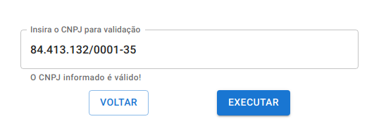
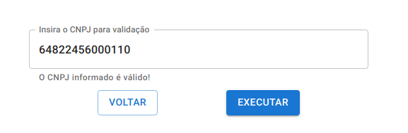
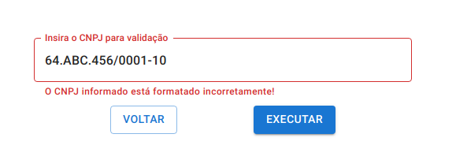
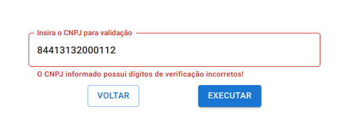

# Exercise 1 - Validate CNPJ format and check digits

## About the resolution

In this resolution i used TDD (Test-driven development), so at first i used Jest to create test cases that covered all the exercise requirements. Then, in the coding process when i had implemented a new validation, i could test if it was correct just running the tests. Therefore, i implemented all the functions that validate the CNPJ in the file `validateCNPJ.ts`, using the pseudocode defined by _Receita Federal_ to verify the check digits.

## Images showing the application running

Valid only numbers CNPJ:

Valid formatted CNPJ:

Invalid format CNPJ:

Invalid check digits CNPJ:

## How to run the code

This Exercise can be executed at this page in the website: [access exercise 1 page](https://codex-pre-qualification-test.web.app/exercise1).
