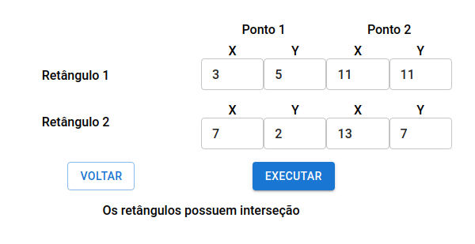
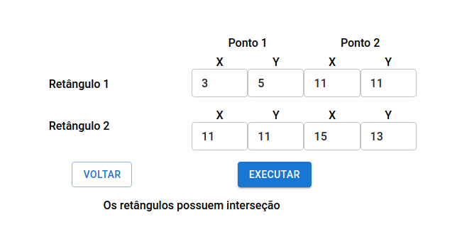
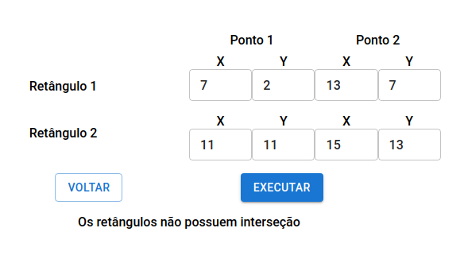

# Exercise 2 - Test if two rectangles intersect

## About the resolution

In this resolution i used TDD (Test-driven development), so at first i used Jest to create test cases with rectangles that intersect and that do not. Then, in the coding process when i had implemented the function to check if two rectangles intersect, i could test if it was correct just running the tests. Therefore, i implemented all the functions to check the intersection in the file `checkRectanglesIntersection.ts`.

## Images showing the application running

Rectangles A and B given in the example:

Rectangles A and C given in the example:

Rectangles B and C given in the example:

## How to run the code

This Exercise can be executed at this page in the website: [access exercise 2 page](https://codex-pre-qualification-test.web.app/exercise2).
